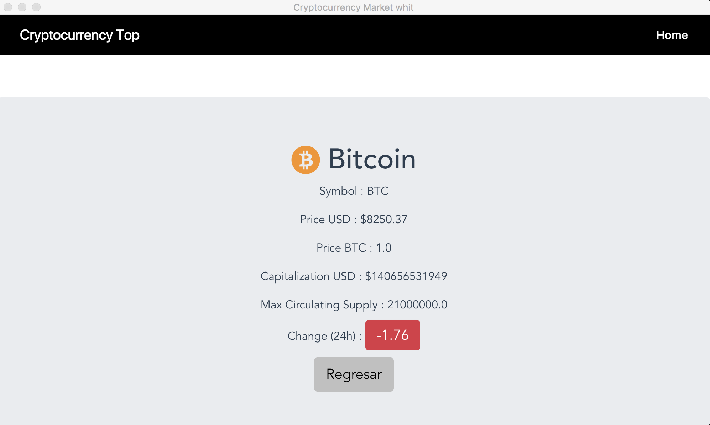

# electron-vue-cryptotop

> Aplicación nativa multiplataforma realizada con Vuejs que muestra el top 20 de Criptomonedas y su detalle.

Puedes seguir la cunstrucción de la aplicación de Criptomonedas paso a paso en:
http://www.proflema.com/index.php/2018/05/09/crear-top-criptomonedas-vuejs-2/

Para construir esta aplicación de forma nativa paso a paso seguir:
http://www.proflema.com/index.php/2018/05/22/top-de-criptomonedas-con-electron-vue/




#### Build Setup

``` bash
# install dependencies
npm install

# serve with hot reload at localhost:9080
npm run dev

# build electron application for production
npm run build


```

---

This project was generated with [electron-vue](https://github.com/SimulatedGREG/electron-vue)@[7c4e3e9](https://github.com/SimulatedGREG/electron-vue/tree/7c4e3e90a772bd4c27d2dd4790f61f09bae0fcef) using [vue-cli](https://github.com/vuejs/vue-cli). Documentation about the original structure can be found [here](https://simulatedgreg.gitbooks.io/electron-vue/content/index.html).
